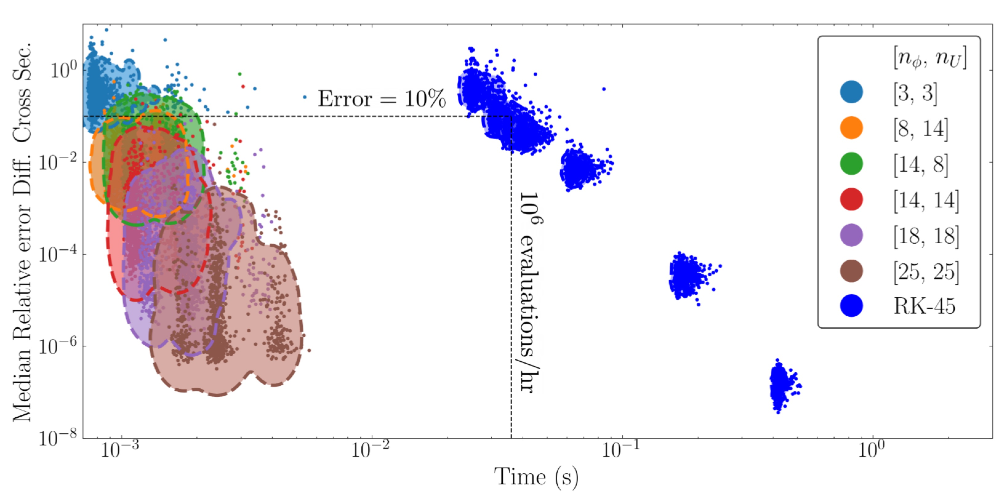

# Overview

## What is ROSE?

ROSE = Reduced-Order Scattering Emulator

`rose` is a Python package, [available on GitHub](https://github.com/odell/rose)
that enables aspiring graduate students and long-suffering postdocs to emulate
nuclear scattering observables with optical potentials, trading negligible
amounts of accuracy for orders-of-magnitude gains in speed.

Specifically, `rose` supports user-defined, local, complex potentials. The
[Koning-Delaroche](https://www.sciencedirect.com/science/article/pii/S0375947402013210)
potential, albeit in simplified form[^1], is hard-coded into `rose` as
`KoningDelaroche`.

Life is full of choices, and many of those choices deal with how you're going to
spend your time. Do you really want to spend years of your life, and possibly
the lives of your successors, waiting for some computer to finish calculating a
cross section? No, you don't. What if you could obtain those results in minutes
at the cost of a few significant digits that you weren't going to look at
anyway? What if you had a plot to help you make these difficult decisions? Like
this one:

If only the rest of life was so accommodating.

For more details about `rose`, see our organic, artisanal, free-range
[documentation](hifi_solver.md). Or start with the [tutorials](tutorials.md).

[^1]: Take Eq. 2 and ignore the energy dependence of the coefficients.